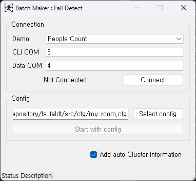
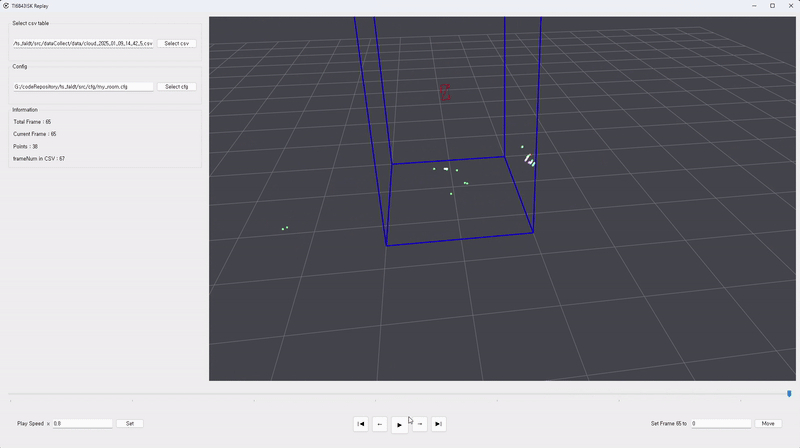

# Fall-detection
Ti IWR6843ISK 기반 낙상감지 시스템\
AI 학습을 위한 train set 수집 및 labeling 프로그램과 AI 모델, Visualizer(UI)를 통합하여 관리하는 프로젝트

## 구성
### Data Collector

* 센서 수집 데이터를 csv 형식으로 저장
* 개선된 DBSCAN 적용한 결과도 저장 가능

### Fall Detecting AI Model
* Clustering과 GRU 기반 Classifier 구성

### Visualizer
* legacy Visualizer

* enhanced Visualizer

* IWR6843ISK의 데이터와 객체 정보를 실시간으로 확인
* 낙상을 비롯한 사람의 상태를 판별하는 실시간 처리 AI 모델 탑재

### Replay

* Data Collector의 결과물인 csv 파일을 시각화하여 확인 가능

### Labeling tool

* 클러스터링 AI 학습을 위한 지도 학습 데이터 생성용 프로그램

## 참고자료
[docs 참조](./docs/README.md)