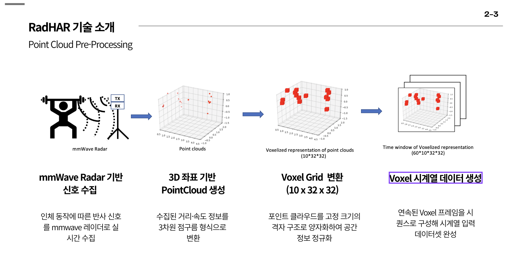
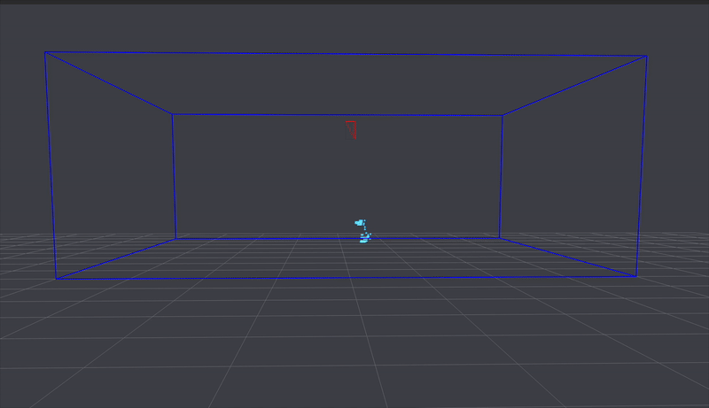
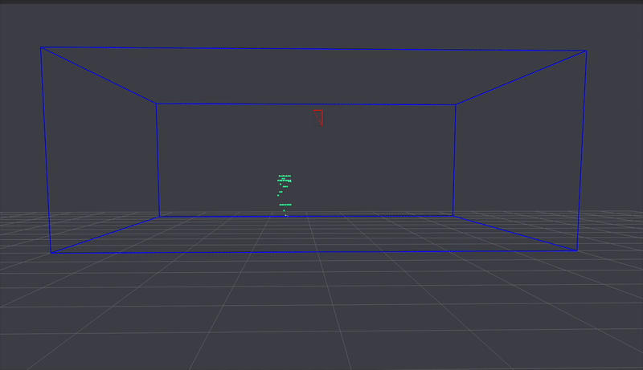
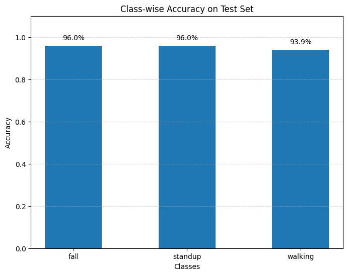
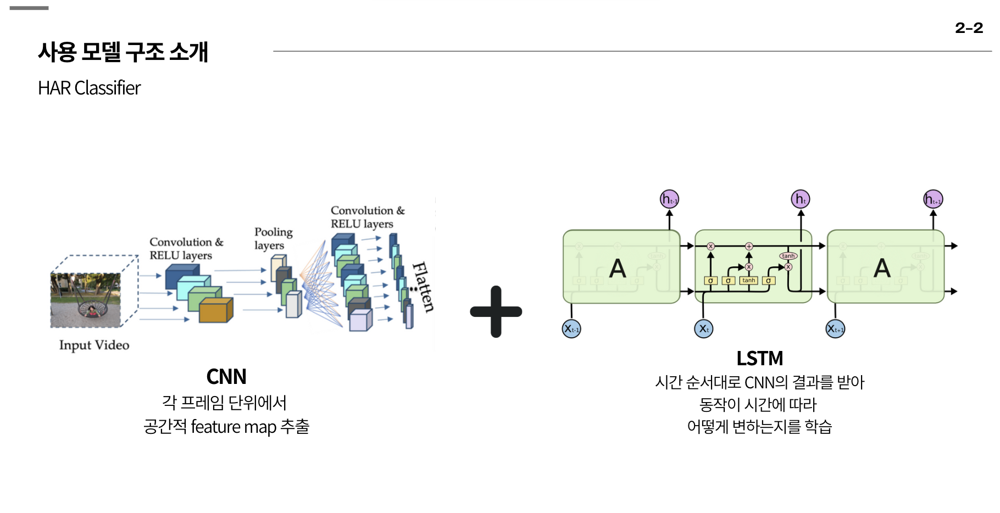
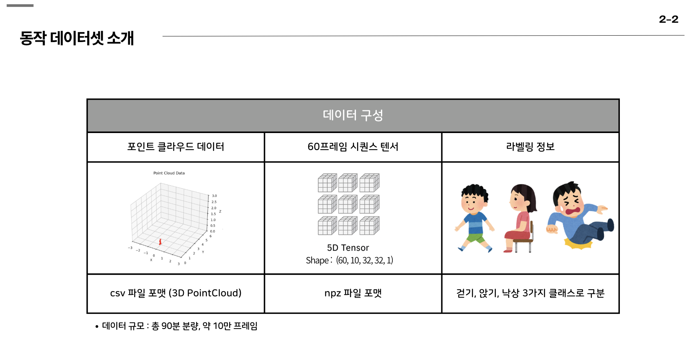

# HAR Classifier AI
***CNN-LSTM 구조의 Human Activity Recognition Model***

* **데이터 입력 전처리 과정 및 기술 소개**

## 데이터 구성
### 총 90분 분량으로 클래스 별로 30분 분량으로 구성-60프레임의 클립 형태

* **낙상(Fall)**

* **일어섬(StandUp)**

* **걷기(walking)**

## **학습 결과**
### Model Loss Curve

### Model Accuracy Cruve

### Class-Wise Accuracy

**Test Set에 대해 검증 결과**
▶ 테스트 데이터 평가 결과 : 손실: 0.1237  / 정확도: 0.9518
▶ 클래스별 평가 결과 : 낙상 : 96 % / 일어섬 : 96 % / 걷기 : 94 %

## Model Download link (CNN-LSTM Classifier)

https://drive.google.com/drive/folders/1M4FzigUM5aWEfhG67bq5dfmEMHxj5EjE?usp=sharing

## HAR Dataset Download link

https://drive.google.com/drive/folders/1TuxXNffSkksaZ47o5zOHULJ-tazc2uHS?usp=sharing

Reference Link : https://github.com/nesl/RadHAR.git